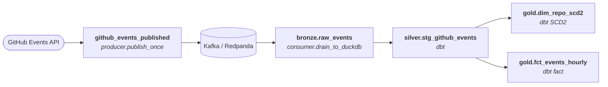

# Streaming Lakehouse Demo

[](https://github.com/turnerluke/streaming-lakehouse-demo/actions/workflows/test.yml)
[](https://github.com/turnerluke/streaming-lakehouse-demo/actions/workflows/lint.yml)
[](https://github.com/turnerluke/streaming-lakehouse-demo/actions/workflows/pipeline-checks.yml)
[](https://turnerluke.github.io/streaming-lakehouse-demo/)

A real-time data platform that ingests the public GitHub Events firehose
through Kafka into a warehouse, models it with dbt into a bronze /
silver / gold medallion (including an SCD Type 2 dimension), and
orchestrates the whole thing as a single Dagster asset graph.

**Live dashboard**: <https://turnerluke.github.io/streaming-lakehouse-demo/>
— an Evidence.dev site rebuilt from the seeded DuckDB warehouse on every
push to `main`, hosted for free on GitHub Pages.

Runs end-to-end locally against DuckDB with **zero cloud spend**.
Cloud (BigQuery) is a swap-in-a-profile away.

## Architecture

Each solid box is a Dagster asset; arrows are the asset dependencies
you'll see in the UI. Kafka is infrastructure between two streaming
assets (not itself an asset). Warehouse is DuckDB locally, BigQuery
in the cloud path — same models both ways.



## Local demo (zero cloud, ~30 seconds)

Requires: [`uv`](https://docs.astral.sh/uv/) and Python 3.13.

```bash
uv sync
cd dbt
cp profiles.yml.example profiles.yml
uv run dbt deps
uv run dbt seed --target duckdb
uv run dbt build --target duckdb
```

Produces `dbt/target/local.duckdb` with 30 seeded events flowing
through the medallion. Poke at it:

```python
# from dbt/
import duckdb
conn = duckdb.connect("target/local.duckdb", read_only=True)
conn.sql("select * from gold.dim_repo_scd2 limit 5").show()
```

Expected shape: `octocat/hello-world` shows the seeded Ruby → Python
migration across 10 SCD2 versions; the hourly fact aggregates 22 rows
across 4 buckets and 10 event types.

## Live pipeline in Dagster

Same warehouse, but everything runs as a live Dagster graph pulling
real GitHub events. Requires Docker (Colima works). From the repo root:

```bash
docker compose up -d redpanda
uv sync
cd dbt && cp profiles.yml.example profiles.yml && uv run dbt deps && cd ..
uv run dagster dev -w dagster_project/workspace.yaml
```

Open <http://localhost:3000>. Materialize the graph:

- `github_events_published` — one poll of GitHub Events → Kafka.
- `bronze.raw_events` — drain Kafka → DuckDB.
- `silver.stg_github_events` — dbt typed/deduplicated staging.
- `gold.dim_repo_scd2` — SCD Type 2 repo attributes.
- `gold.fct_events_hourly` — event counts per (hour, type).

The hourly schedule (`dbt_hourly_job`) rebuilds only the dbt layer;
streaming assets materialize on demand so no cron ever hits GitHub or
Kafka unattended.

## What's under the hood

| Layer          | Tech                                                                                                                                   |
| -------------- | -------------------------------------------------------------------------------------------------------------------------------------- |
| Ingestion      | Python + `confluent_kafka` producer polling the GitHub Events API with ETag + `X-Poll-Interval` respect                                |
| Message bus    | Redpanda (Kafka-compatible) for local, Confluent Cloud-ready for prod                                                                  |
| Landing        | DuckDB for local dev, BigQuery for cloud (same models via adapter-dispatch macros)                                                     |
| Transformation | dbt medallion (bronze/silver/gold), ~240 lines of SQL across 3 models + 4 dispatch macros, incremental SCD2 dim, insert-overwrite fact |
| Orchestration  | Dagster asset graph — one code location covering ingestion + transformation                                                            |
| Quality        | 42 unit tests, 1 Redpanda-backed integration test, ~19 dbt tests per build, terraform `fmt`+`validate` on CI                           |
| Dev tooling    | `uv`, `pre-commit`, `ruff` with `select = ["ALL"]` and `typing.Any` banned, `commitlint`, `sqlfluff`, `shellcheck`, `gitleaks`         |

## Layout

| Path                 | Contents                                                                                         |
| -------------------- | ------------------------------------------------------------------------------------------------ |
| `producer/`          | GitHub Events poller (long-running loop + Dagster one-shot)                                      |
| `consumer/`          | Kafka → warehouse writers (BigQuery + DuckDB variants)                                           |
| `dbt/`               | Medallion models, seed data, dialect-dispatched macros                                           |
| `dagster_project/`   | Streaming + dbt assets as a single graph                                                         |
| `terraform/`         | GCP BQ datasets + IAM (unapplied — cloud is deferred)                                            |
| `evidence/`          | Evidence.dev dashboard — rebuilt from the seeded DuckDB and deployed to GitHub Pages on push     |
| `tests/`             | Unit tests + a Docker-backed integration suite (marker-scoped)                                   |
| `scripts/`           | `watch-pr.sh` PR poller, `worktree-new.sh` / `worktree-drop.sh`, `set-billing-alert.sh` reminder |
| `.github/workflows/` | Per-linter parallel CI, subproject-matrix tests, terraform gate                                  |

## Design decisions worth calling out

- **Dialect-dispatch dbt macros** (`json_get`, `trunc_hour`, `hours_ago`,
  `hex_md5`) let the same medallion SQL run on both BigQuery and
  DuckDB. See `dbt/macros/dialect_dispatch.sql`.
- **Producer/consumer stay callable both ways.** `poll_and_publish` /
  `consume_and_load` run as standalone long-loops; `publish_once` /
  `drain_to_duckdb` run as Dagster asset materializations. On the
  consumer side, both share the `_to_row` message-to-row helper so
  the two paths can't drift on schema shape.
- **`typing.Any` is banned repo-wide.** Ruff `ANN401` +
  `flake8-tidy-imports` reject it at CI time. See
  [`docs/policies/no-any.md`](docs/policies/no-any.md).
- **Sprint prompts are gitignored.** The PR body is the durable
  historical record; the scoping doc is authored per-PR and disappears
  on merge. See [`AGENTS.md`](AGENTS.md).

## Status

Local end-to-end **works**: `git clone` → run five commands → a live
Dagster graph rebuilds a DuckDB medallion from real GitHub Events.
Every check in every PR is green. The seeded medallion is also
published as a public
[Evidence dashboard](https://turnerluke.github.io/streaming-lakehouse-demo/)
via a `pages.yml` workflow that rebuilds on every push to `main`.

Cloud is **coded but not provisioned**. Terraform for BQ + IAM is
authored and passes `validate`; the consumer's BQ writer is unit- and
type-checked; the Evidence dashboard skeleton reads from the BQ
schema. What's missing is a click on `terraform apply` — deliberate,
because free tier or not, unattended cloud tends to grow bills.

## Contributing / conventions

Repo standards (branch/PR rules, commit format, lint stack, sprint
discipline, `typing.Any` ban) live in [`AGENTS.md`](AGENTS.md).
Review posture in [`REVIEW.md`](REVIEW.md). Every increment lands as a
single focused PR driven by a local (gitignored) `prompt-<slug>.md`.
